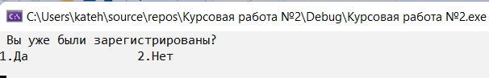
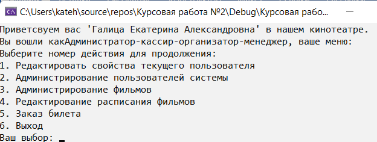
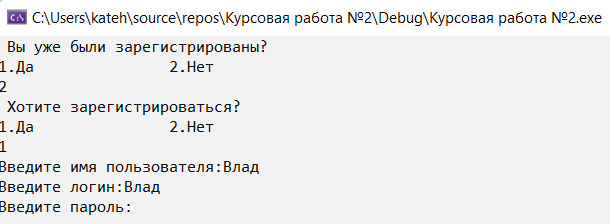
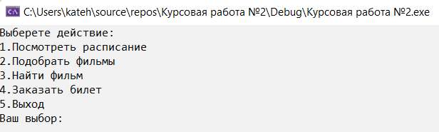
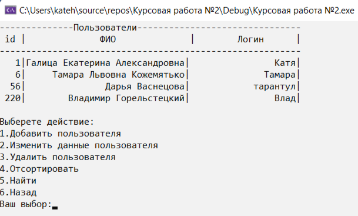
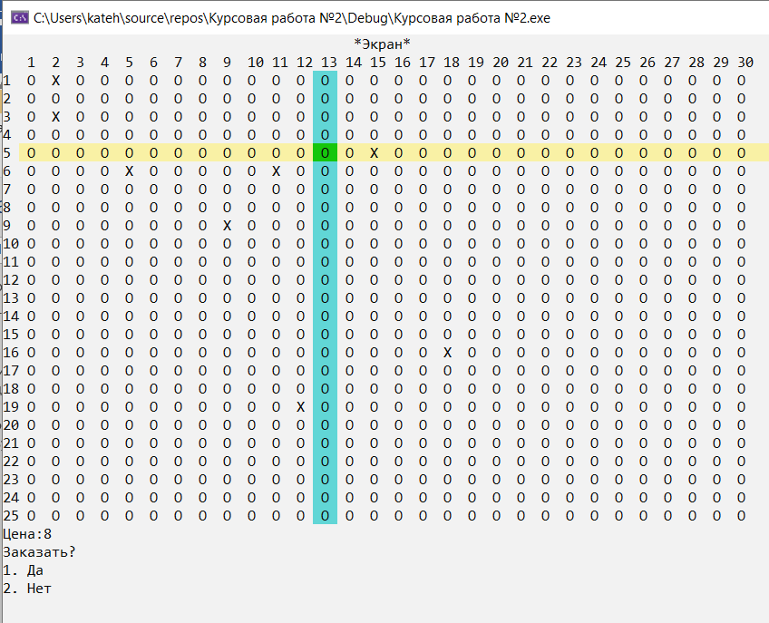

# Cinema Console App (Java)

**Cinema Console App** is a simple command-line application developed in Java for managing cinema operations. The app enables users to browse movies, view showtimes, and handle ticket bookings through a straightforward text-based interface.

### Key Features:

* Display a list of movies with descriptions and showtimes
* Book and cancel tickets via console commands
* Manage seat availability and booking records
* User-friendly text-based menu navigation
* Data stored using file system or simple in-memory structures

### Technologies Used:

* Java SE
* Console-based user interface
* File handling for data persistence

---
# Interface Description
## Cinema console application
A console cinema management application that allows users to register, log in and select roles, as well as sort and search users, order tickets and manage the user database.
### Authorization
When entering the program, the user is asked whether he has been registered before.

If the user claims that he has been registered, a situation arises.

If the login is correct, a situation arises in accordance with the role the user plays in the system.

If the user does not claim that he was registered, but wants to, then a situation arises.

After self-registration, the user will be assigned the role of spectator and the spectator menu will appear.

### Sorting
If sorting is required, then a situation arises as in the picture.

The result of sorting by name in the picture.

### Search result
Search by name.

### Booking tickets
An example of ordering a ticket when choosing a seat in the hall.

